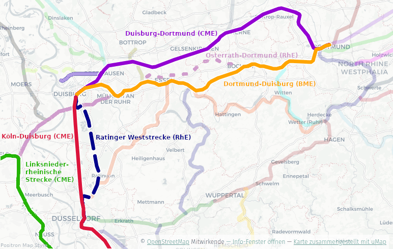

# Bahnstrecken im Ruhrgebiet

Die Eisenbahn gehört zur DNA des Ruhrgebiets. Zunächst vor allem als überregionale Verbindung geplant, wurde sie schon bald zum entscheidenden Verkehrsmittel für die aufsteigende Industrialisierung. Kohle, Erz und Stahl mussten in immer größeren Mengen von den Zechen und Hüttenwerken zu den Flüssen, Häfen und weiter zu den Abnehmern transportiert werden. Gleichzeitig wuchsen die Städte, und mit ihnen entstand ein stetig zunehmender Bedarf an Personenverkehr.

<!-- more -->

Den Anfang machte die **Köln-Mindener Eisenbahn-Gesellschaft (CME)**. Ihre Stammstrecke von Deutz über Düsseldorf, Duisburg, Oberhausen, Gelsenkirchen, Wanne, Herne und Dortmund nach Minden wurde zwischen 1845 und 1847 gebaut. Die Verbindung sollte das Rheinland mit dem preußischen und norddeutschen Eisenbahnnetz verbinden. Dass die Strecke das Ruhrgebiet zunächst nördlich der damaligen Siedlungs- und Bergbauzentren durchquerte, war kein Zufall: Eine Trasse durch das bergige Wuppertal wäre deutlich teurer gewesen. Die flachere Route versprach geringere Baukosten, obwohl sie zunächst an vielen der damals entstehenden Zechen vorbeiführte.

Der Bergbau sorgte allerdings schnell dafür, dass die Bahnstrecke ihre ursprüngliche Funktion verlor. Die Zechen bauten Anschlussbahnen zu den Bahnhöfen der CME, um die Kohle auf die Hauptstrecke zu bringen. Schon in den 1870er-Jahren verband die Gesellschaft auf diese Weise eine Vielzahl der entstehenden Zechen mit ihrem Netz. Die Eisenbahn wurde damit nicht mehr nur zur Verbindung von Städten, sondern zum Rückgrat eines immer dichter werdenden industriellen Verkehrsnetzes.

Die **Bergisch-Märkische Eisenbahn-Gesellschaft (BME)** schuf ab den 1850er-Jahren eine zweite große Achse durch das Ruhrgebiet. Ihre um 1862 fertiggestellte Strecke von Dortmund beziehungsweise Witten über Bochum, Essen und Mülheim nach Duisburg beziehungsweise Oberhausen verlief wesentlich näher an den Zentren des südlichen Ruhrgebiets. Sie erschloss damit zahlreiche Zechen und Industriestandorte, die von der nördlicher gelegenen Köln-Mindener Strecke nur unzureichend erreicht wurden. Hinzu kamen Verbindungen in Richtung Hagen, Hamm, Soest, Wuppertal und ins Ruhrtal.

Als dritte große Gesellschaft stieg die **Rheinische Eisenbahn-Gesellschaft (RhE)** in den Wettbewerb ein. 1866 erreichte ihre Strecke von Osterath über Uerdingen, Rheinhausen, Duisburg, Mülheim Essen. Bis 1874 wurde sie über Bochum und Langendreer bis Dortmund verlängert. Ihr Geschäftsmodell zielte besonders auf den Kohlentransport: Die Gesellschaft warb mit günstigen Tarifen und legte vielfach eigene Anschlüsse zu Zechen an. Weitere Strecken, etwa von Duisburg über Oberhausen, Bottrop und Dorsten nach Quakenbrück, ergänzten das Netz.

So entstand innerhalb weniger Jahrzehnte ein außergewöhnlich dichtes Eisenbahnnetz. Die drei Gesellschaften konkurrierten um Städte, Zechen und Frachten. Sie bauten teilweise Strecken, die nur wenige Kilometer voneinander entfernt verliefen. Um 1880 endete diese Phase der privaten Konkurrenz: Die großen Eisenbahngesellschaften wurden verstaatlicht und gingen in der preußischen Eisenbahnverwaltung auf. Damit konnten konkurrierende Strecken zusammengeführt, Verbindungen neu geordnet und in den folgenden Jahrzehnten nach und nach auch wenig rentable Abschnitte stillgelegt werden. Gleichzeitig wuchs das Netz weiter, denn der Bedarf der expandierenden Industrie und der stark wachsenden Bevölkerung nahm weiter zu.

Von diesem historischen Netz ist heute ein bemerkenswerter, aber stark veränderter Teil erhalten. Einige der einstigen Hauptstrecken gehören noch immer zu den wichtigsten Bahnverbindungen der Region: Die **Köln-Mindener Strecke** bildet weiterhin eine zentrale Ost-West-Achse im Norden des Ruhrgebiets, während die ehemalige **Bergisch-Märkische Verbindung über Essen und Bochum** heute zu den meistbefahrenen Strecken des Ballungsraums zählt. Dazu kommen weitere historische Verbindungen wie die Ruhr-Sieg-Strecke oder Abschnitte der Ruhrtalbahn. Die ehemaligen Trassen der **Rheinischen Eisenbahn** haben dagegen einen besonders tiefgreifenden Wandel erfahren: Viele Abschnitte sind stillgelegt, teilweise abgebaut und zu Rad- und Wanderwegen umgestaltet worden. Andere dienen noch dem Güterverkehr oder dem S-Bahn-Verkehr.

Gleichzeitig ist das heutige Ruhrgebietsnetz nicht einfach das alte Netz der drei Eisenbahngesellschaften. Neue Verbindungs- und S-Bahn-Strecken, Umbauten, Ausbauten und Elektrifizierungen haben die historische Infrastruktur überformt. Von den einst zahllosen Zechenanschlüssen sind nur wenige übrig geblieben; viele ehemalige Bahndämme, Brücken und Einschnitte erinnern heute nur noch als Relikte oder Radwege an ihre industrielle Vergangenheit. Gerade darin liegt der besondere Reiz der Eisenbahnlandschaft des Ruhrgebiets: Das heutige Netz ist zugleich Verkehrsinfrastruktur, Industriedenkmal und sichtbares Archiv der Geschichte des Reviers.

<figure markdown="span">
  
  <figcaption>Zentrale Bahnstrecken im Ruhrgebiet</figcaption>
</figure>

## Zentrale Strecken auf der Nord-Süd-Achse

Die Ost-West-Stämme erzählen nur einen Teil der Geschichte des Ruhrgebiets. Schon früh entstanden daneben Strecken, die den Ballungsraum nach Süden an den Rhein und das Rheinland anbanden. Zwei von ihnen führen seit den Anfängen der Industrialisierung auf dem rechten Rheinufer in den Kölner Raum, eine dritte verbindet Duisburg über die linksrheinische Seite mit dem Niederrhein und Köln.

### Bahnstrecke Köln–Duisburg (über Leverkusen)

Mit der Bahnstrecke Köln–Duisburg beginnt zugleich die Eisenbahngeschichte des Ruhrgebiets: Sie ist der älteste Abschnitt der Köln-Mindener Stammstrecke und wurde zwischen Dezember 1845 und Februar 1846 als erste Teilstrecke der Gesellschaft eröffnet[^1]. Weil über sie schon früh der gesamte Verkehr zwischen dem Rheinland und den aufstrebenden Industrierevieren an Rhein und Ruhr lief, wurde sie im Lauf der Zeit mehrfach ausgebaut und modernisiert. Heute ist sie in eine Fernbahn (Streckennummer 2650) und eigene parallel geführte S-Bahn-Gleise (2670) aufgeteilt. Auf der Fernbahn verkehren neben dem Fernverkehr unter anderem der RE1 und der RE5; auf den S-Bahn-Gleisen bindet die S6 die Städte am rechten Rheinufer über Leverkusen und Langenfeld an Düsseldorf und Köln an[^2]. Wegen der hohen Auslastung stufte die Bahn den Abschnitt 2014 als "überlasteten Schienenweg" ein; seitdem wird er im Zuge des Rhein-Ruhr-Expresses (RRX) leistungsfähig ausgebaut[^1].

### Ratinger Weststrecke (Düsseldorf–Ratingen–Duisburg)

Die Ratinger Weststrecke ist der Abschnitt Duisburg-Wedau–Düsseldorf-Rath der Bahnstrecke Mülheim-Speldorf–Troisdorf[^27], die im 19. Jahrhundert von der Rheinischen Eisenbahn-Gesellschaft erbaut wurde. Der Bahnhof Ratingen West entstand 1874 unter dem Namen "Ratingen Rheinisch" und wurde nach der Verstaatlichung in Ratingen West umbenannt[^3]. Seit dem Ende des Personenverkehrs dient die Strecke nahezu ausschließlich dem überregionalen Güterverkehr. Genau deshalb bemühen sich die Städte Duisburg, Düsseldorf und Ratingen zusammen mit dem VRR seit Jahren um eine Wiederaufnahme des Personenverkehrs: Eine vorliegende Machbarkeitsstudie bestätigte, dass ein Ausbau machbar und volkswirtschaftlich sinnvoll ist, und im Juli 2026 unterzeichneten VRR und Deutsche Bahn eine gemeinsame Planungsvereinbarung[^4]. Langfristig sollen zwei neue S-Bahn-Linien den Duisburger Süden über Duisburg-Wedau direkt an Ratingen und Düsseldorf anbinden. Eine ausführliche Darstellung bietet die [Projektseite zur Reaktivierung der Ratinger Weststrecke](../../../ÖPNV_Projekte/Ratinger%20Weststrecke/index.md).

### Linksniederrheinische Strecke (Kleve–Krefeld–Neuss–Dormagen–Köln)

Die Linksniederrheinische Strecke wurde bereits in den Jahren 1855 und 1856 von der Köln-Krefelder Eisenbahn-Gesellschaft von Köln über Neuss bis Krefeld eröffnet und gehört damit zu den ältesten Bahnstrecken Deutschlands[^5]. Sie verknüpft den linksrheinischen Niederrhein über Krefeld und Neuss mit dem Kölner Raum und bildet mit der Streckennummer 2610 die zentrale Personenverkehrsachse am linken Rheinufer. Während der Abschnitt Köln–Krefeld durchgehend mehrgleisig und elektrifiziert ist, ist die Fortsetzung nach Kleve nördlich von Geldern nur eingleisig und ohne Oberleitung ausgeführt[^5]. Genutzt wird die Strecke unter anderem vom RE10 zwischen Kleve und Düsseldorf, vom RE6, der das Ruhrgebiet mit dem Rheinland verbindet, vom RE7 bis nach Köln sowie von der S11 zwischen Düsseldorf, Neuss, Dormagen, Köln und Bergisch Gladbach.

## Zentrale Strecken auf der Ost-West-Achse

Das eigentliche Rückgrat des Ruhrgebiets bilden zwei nahezu parallele, zeitlich wie verkehrlich aber sehr unterschiedliche Ost-West-Trassen. Die nördliche, von der Köln-Mindener Eisenbahn-Gesellschaft gebaute Stammstrecke erschloss das nördliche Ruhrgebiet, während die südlichere Strecke der Bergisch-Märkischen Eisenbahn-Gesellschaft näher an den Zentren des alten Industriegürtels verläuft. Beide zusammen umfassen die wichtigsten Bahnverbindungen zwischen Rhein und Westfalen.

### Bahnstrecke Duisburg–Dortmund (über Oberhausen und Gelsenkirchen)

Die Bahnstrecke Duisburg–Dortmund ist der mittlere Teil der Köln-Mindener Stammstrecke und wurde 1847 eröffnet[^6]. Sie verbindet Duisburg über Oberhausen, Essen-Altenessen, Gelsenkirchen, Herne und Castrop-Rauxel mit dem Dortmunder Hauptbahnhof und trägt als Fernbahn die Streckennummer 2650. Trotz ihrer zentralen Lage ist sie heute weniger eine Fernverkehrs- als eine der wichtigsten Nahverkehrsstrecken des Ballungsraums: Auf ihr verkehren der RE3 (Rhein-Emscher-Express), die 2019 eingeführte RB32, die den früheren Stundentakt der S2 zwischen Duisburg und Dortmund übernommen hat, sowie die Emscher-Niederrhein-Bahn RB35[^7]. Zwischen Herne und Dortmund ergänzt die S-Bahn-Linie S2 den Verkehr im Halbstundentakt.

### Bahnstrecke Dortmund–Duisburg (über Bochum, Essen und Mülheim)

Die südliche Parallelstrecke wurde zwischen 1860 und 1862 von der Bergisch-Märkischen Eisenbahn-Gesellschaft errichtet und zählt heute zu den wichtigsten Eisenbahnstrecken Deutschlands[^8]. Sie verläuft von Dortmund über Bochum, Wattenscheid, Essen und Mülheim nach Duisburg und trägt zusammen mit ihren Nebengleisen den größten Teil des Personenverkehrs auf der Ost-West-Achse des Ruhrgebiets. Der Fernbahnabschnitt setzt sich aus den Streckennummern 2158, 2160, 2300 und 2184 zusammen, die S-Bahn verkehrt auf eigenen Gleisen (2190, 2291, 2290). Im Regionalverkehr wird die Strecke unter anderem vom RE1, RE2, RE6, RE11 und RE42, vom RE49 sowie von der RB33 bedient; die S-Bahn-Linien S1 und S3 nutzen ebenfalls diese Trasse. Die S1 bildete mit ihren ersten Abschnitten zwischen Bochum und Duisburg ab 1974 den Auftakt des planmäßig ausgebauten S-Bahn-Netzes Rhein-Ruhr[^9].

### Bahnstrecke Osterath–Dortmund Süd (Krefeld–Duisburg–Mülheim–Essen–Bochum–Dortmund)

Die Bahnstrecke Osterath–Dortmund Süd der Rheinischen Eisenbahn-Gesellschaft ist das anschaulichste Beispiel für die einst scharfe Konkurrenz der großen Bahngesellschaften. Sie entstand zwischen 1866 und 1874 in mehreren Etappen als dritte große Ost-West-Verbindung durch das Ruhrgebiet und band die Zechen zwischen Rhein und Ruhr auch an das Streckennetz der rheinischen Bahnen an[^10]. Dabei musste die Bahn den Rhein zunächst mit einer Eisenbahnfähre (Trajekt) bei Rheinhausen-Hochfeld überqueren, bis 1873 die erste Duisburg-Hochfelder Eisenbahnbrücke eröffnet wurde[^11]. Von der einstigen Hauptstrecke ist heute wenig übrig: Im Abschnitt Rheinhausen–Duisburg Hauptbahnhof verkehren über die Verbindungsstrecke 2312 mehrere Nahverkehrslinien, darunter RE42, RE44, RB31, RB33 und RB35. Östlich von Duisburg-Hochfeld bis zum Rhein-Ruhr-Hafen wird der Verlauf (Strecken 2324 und 2505) nur noch vom Güterverkehr genutzt, und der Abschnitt in Richtung Mülheim ist weitgehend vom Radschnellweg Ruhr (RS1) überbaut[^12]. Die Allianz pro Schiene schlägt eine Reaktivierung der Strecke zur Stabilisierung der Betriebsqualität vor[^13], während andererseits ein weiterer Rückbau bis Hochfeld für die Fortsetzung des RS1 gefordert wird. Idealerweise wird eine Lösung gefunden, welche sowohl die Reaktivierung als auch den Bau des RS1 erlaubt, ohne Bahn und Fahrrad gegeneinander auszuspielen[^14].

## Diagonale Strecken

### Ruhrtalbahn (Düsseldorf–Kettwig–Essen–Bochum–Hagen)

Mit der Ruhrtalbahn entstand zwischen 1870 und 1876 eine weitere große Strecke der Bergisch-Märkischen Eisenbahn-Gesellschaft, die dem Lauf der Ruhr von Düsseldorf-Rath über Essen-Kupferdreh, Bochum-Dahlhausen, Hattingen und Witten bis nach Hagen-Vorhalle folgte[^15]. Über die anschließende Obere Ruhrtalbahn führte sie weiter über Schwerte in Richtung Warburg. Sie erschloss die Zechen und Hütten des südlichen Ruhrgebiets ebenso wie die rechtsrheinischen Umlandstädte und trägt die Streckennummer 2400. Von der einst durchgehenden Verbindung sind heute nur Teilstrecken in Betrieb – einige davon zählen zum ältesten S-Bahn-Verkehr der Region: Der westliche Abschnitt über Hösel, Kettwig und Essen-Werden wird bereits seit den späten 1960er-Jahren von einer S-Bahn-Linie befahren und ist seitdem das Rückgrat der heutigen S6 zwischen Essen, Düsseldorf und Köln[^15]. Zwischen Essen und Hattingen nutzt zudem die S3 den Streckenverlauf. Viele der übrigen Abschnitte sind stillgelegt und zum Teil abgebaut worden; mehrere dienen heute als Rad- und Wanderwege.

## Strecken zu Satellitenstädten

Neben den großen Stämmen entstand schon im 19. Jahrhundert ein dichtes Netz von Querverbindungen, das Städte, Zechen und Industriestandorte untereinander verzahnte. Einige dieser Strecken erschlossen Ortschaften, die selbst nie zu den großen Verkehrsknoten des Reviers gehörten – die Satellitenstädte am Rand des Ballungsraums. Sie sind oft nur über wenige Linien erreichbar und zeigen besonders deutlich, wie sich das historische Netz zu einem Nahverkehrssystem gewandelt hat.

### Bahnstrecken Mülheim-Heißen–Oberhausen-Osterfeld Nord & Essen-Dellwig Ost–Bottrop

Die Strecken 2280 und 2248 bilden zusammen eine wichtige Nord-Süd-Verbindung zwischen dem Essener Hauptbahnhof und dem nördlichen Ruhrgebiet. Der südliche Teil (Mülheim-Heißen–Oberhausen-Osterfeld Nord[^28]) wurde 1872 von der Rheinischen Eisenbahn-Gesellschaft errichtet; die kurze Fortführung zwischen Essen-Dellwig Ost und dem Bottroper Hauptbahnhof (2248) wurde dagegen bereits 1922 errichtet; nachdem ihre Bauwerke im Zweiten Weltkrieg zerstört worden waren, verband die Deutsche Bundesbahn die unterbrochene Trasse 1952 wieder[^9][^16]. Über diese Verbindung erreichen der RE14, der von Essen über Bottrop und Dorsten bis nach Borken beziehungsweise Coesfeld fährt, und die S-Bahn-Linie S9 die Städte des westlichen Ruhrgebiets. Die S9 verkehrt seit 1998 zwischen Haltern am See beziehungsweise Recklinghausen und Essen(-Steele) und wurde ab 2019 schrittweise über Velbert und Wuppertal bis nach Hagen verlängert[^9].

### Bahnstrecke Rheinhausen–Kleve

Die Bahnstrecke Rheinhausen–Kleve, auch Niederrheinstrecke genannt, wurde 1904 eröffnet und zweigt im Bahnhof Rheinhausen aus der Strecke der Rheinischen Eisenbahn-Gesellschaft ab[^17]. Sie erschloss die Städte am linken Niederrhein – Moers, Rheinberg, Xanten, Kalkar und Kleve – und zeigt, wie stark auch kleinere Ortschaften auf die Schiene angewiesen waren, bevor nach dem Zweiten Weltkrieg nahezu alles auf die Straße verlagert wurde. Heute ist nur noch der Abschnitt bis Xanten in Betrieb: Auf der Strecke 2330 verkehren die RB31 von Xanten über Moers und Rheinhausen nach Duisburg sowie die RE44, die von Moers über Duisburg und Oberhausen nach Bottrop führt. Der Abschnitt zwischen Xanten und Kleve ist seit 1990 stillgelegt[^17]. Als Perspektive gilt die Reaktivierung der Niederrheinbahn in Richtung Kamp-Lintfort: Nach einem ersten Pendelbetrieb zur Landesgartenschau 2020 soll die RE44 über die reaktivierte Zechenbahn künftig weiter bis nach Kamp-Lintfort und perspektivisch Neukirchen-Vluyn fahren[^18].

## Strecken nach Norden und Westen

### Bahnstrecke Wanne-Eickel–Hamburg (über Münster, Osnabrück und Bremen)

Die Bahnstrecke Wanne-Eickel–Hamburg ist die kürzeste Eisenbahnverbindung zwischen dem Ruhrgebiet und der Metropolregion Hamburg und verläuft über Münster, Osnabrück und Bremen[^19]. Sie wurde zwischen 1870 und 1874 von der Köln-Mindener Eisenbahn-Gesellschaft gebaut und zweigt in Wanne-Eickel aus deren Stammstrecke ab; zusammen mit der Haltern–Venlo-Strecke bildete sie die Hamburg-Venloer Bahn, eine Verbindung von Hamburg nach Paris[^19]. Wegen des Tag und Nacht dichten Verkehrs erhielt sie in der Nachkriegszeit den Spitznamen "Rollbahn". Mit der Streckennummer 2200 ist sie heute durchgehend zweigleisig und elektrifiziert, streckenweise sind 200 km/h zugelassen. Im Fernverkehr ist sie das Rückgrat der Verbindung zwischen Ruhrgebiet und Hamburg; im Nahverkehr fahren der RE2 zwischen Recklinghausen und Osnabrück sowie die S-Bahn-Linie S2 bis Recklinghausen über die Strecke[^19].

### Bahnstrecke Oberhausen–Arnhem (über Wesel und Emmerich)

Mit der Bahnstrecke Oberhausen–Arnhem entstand 1856 eine der ersten internationalen Eisenbahnverbindungen des Reviers: Am 1. Juli 1856 eröffnete die Köln-Mindener Eisenbahn-Gesellschaft den Abschnitt Oberhausen–Dinslaken, am 20. Oktober 1856 die gesamte zweigleisige Strecke über Wesel und Emmerich bis zur niederländischen Landesgrenze[^20]. Sie zweigt in Oberhausen aus der CME-Stammstrecke ab und schließt in Arnhem an den Rhijnspoorweg nach Amsterdam an[^20]. Der Bahnhof Wesel war bis zum Zweiten Weltkrieg der Eisenbahnknotenpunkt des Niederrheins; hier kreuzten sich die Strecke nach Haltern–Venlo, die Wesel–Bocholt-Strecke, die Boxteler Bahn und die Strecke über Walsum zurück nach Oberhausen. Heute trägt die auch "Hollandstrecke" genannte Strecke die Nummer 2270 und ist Teil der Transeuropäischen Netze. Über sie verkehren unter anderem der RE19 von Arnhem über Wesel nach Düsseldorf, der RE5 bis Wesel sowie der ICE nach Amsterdam; seit 2021 fahren zudem ÖBB-Nightjet-Züge zwischen Amsterdam und Wien beziehungsweise Zürich. Weil die Strecke zugleich eine zentrale Güterachse Richtung Rotterdam ist, wird sie im Zuge der Betuweroute-Verbindung auf drei Gleise ausgebaut und für 200 km/h ertüchtigt; im Rahmen der Generalsanierung war sie von November 2024 bis Mai 2026 mehrfach gesperrt[^20].

## Strecken im Bergischen Raum

### Bahnstrecke Wuppertal-Vohwinkel–Essen-Überruhr / Düsseldorf–Elberfeld / Elberfeld–Dortmund

Die folgenden Strecken bilden die historische Achse der Düsseldorf-Elberfelder und der Bergisch-Märkischen Eisenbahn. Sie erschlossen das dicht besiedelte Wuppertal und das Bergische Land und verbanden die Rheinschiene über die Wuppersenke mit Dortmund und dem Ruhrtal.

Die Bahnstrecke Düsseldorf–Elberfeld ist die Stammstrecke der 1835 gegründeten Düsseldorf-Elberfelder Eisenbahn-Gesellschaft (DEE). Ihre erste Teilstrecke von Düsseldorf nach Erkrath wurde am 15. Oktober 1838 eröffnet und war damit die erste dampfbetriebene Eisenbahnstrecke im Westen Deutschlands; die gesamte 27 Kilometer lange Verbindung nach Wuppertal folgte 1841[^21]. Größtes Hindernis war die Steilrampe Erkrath–Hochdahl mit 33,3 Promille Steigung, über die die Züge lange per Seilzug geführt werden mussten. Seit 1857 gehörte die Strecke zur Bergisch-Märkischen Eisenbahn-Gesellschaft. Heute ist sie mit der Fernbahn (2550) und den parallel geführten S-Bahn-Gleisen (2525) der wichtigste Zugang Wuppertals zum Fern- und Regionalverkehr: Über sie führen sämtliche EC/IC/ICE-Verbindungen der Stadt sowie die RB48 (Rhein-Wupper-Bahn) nach Köln, die S8 verkehrt durchgehend, und S9, S28 sowie die Verstärkerlinie S68 nutzen die S-Bahn-Gleise[^21].

Die Bahnstrecke Wuppertal-Vohwinkel–Essen-Überruhr ist die älteste noch in Betrieb befindliche Eisenbahnstrecke Deutschlands. Ihre Vorläuferin, die 1831 eröffnete Deilthaler Eisenbahn, durchfuhr das Deilbachtal; ab 1844 baute die Prinz-Wilhelm-Eisenbahn-Gesellschaft die Trasse auf Normalspur um und verlängerte sie bis 1847 von Vohwinkel bis nach Überruhr[^22]. Seit 1854 führte die Bergisch-Märkische Eisenbahn-Gesellschaft den Betrieb, 1863 übernahm sie die Gesellschaft vollständig. Die Streckenteile 2723 und 2400 verbinden heute Wuppertal über das Niederbergische Land mit dem Ruhrtal und Essen; seit 2003 sind sie durchgehend elektrifiziert. Befahren wird die Strecke von der S9 von Wuppertal über Essen nach Recklinghausen beziehungsweise Haltern am See, die zwischen Wuppertal und Gladbeck West seit 2019 im 30-Minuten-Takt verkehrt, sowie in der Hauptverkehrszeit stündlich vom RE49 (Wupper-Lippe-Express) bis Wesel[^22].

Die Bahnstrecke Elberfeld–Dortmund ist die eigentliche Stammstrecke der Bergisch-Märkischen Eisenbahn-Gesellschaft (BME): Sie wurde ab 1844 auf Anregung Friedrich Harkorts gebaut und 1849 durchgehend eröffnet[^23]. Sie verbindet Wuppertal über Schwelm, Gevelsberg und Hagen (Strecken 2550 und 2801) mit Dortmund; die S-Bahn verkehrt zwischen Wuppertal und Schwelm auf eigenen Gleisen (2525)[^23]. Seit 1988 nutzen der Fernverkehr und einige Regionalzüge zwischen Witten und Dortmund eine Neubaustrecke. Heute wird die Strecke unter anderem von der S8 nach Mönchengladbach, der S5 zwischen Dortmund und Hagen, dem RE4 (Wupper-Express) sowie dem ICE zwischen Köln und Berlin befahren[^23].

## Rhein-Ruhr-Express (RRX)

Die historischen Stammstrecken bilden bis heute das Gerüst des Schienenverkehrs im Ruhrgebiet – doch sie nützen nur, wenn auf ihnen auch ausreichend Züge fahren. Der Rhein-Ruhr-Express (RRX) setzt genau hier an: Er verdichtet das bestehende Schienennetz zwischen dem Rheinland und dem Ruhrgebiet und macht es mit mehreren Linien in einem dichten und vertakteten Angebot nutzbar. Nach dem Aus- und Umbau der Infrastruktur sollen zwischen Dortmund und Köln im dichten Takt Züge verkehren, über Weiterführungen der Linien sind dabei auch die übrigen Landesteile Nordrhein-Westfalens angebunden[^24]. Die Züge fahren zum normalen Nahverkehrstarif und damit ohne Aufpreis.

Die folgenden RRX-Linien sind im NRW-Takt Zielnetz 2040[^24] definiert:

- **RRX 1:** Aachen – Köln – Düsseldorf – Duisburg – Essen – Dortmund
- **RRX 2:** Aachen – Köln – Düsseldorf – Duisburg – Essen – Dortmund – Hamm – Paderborn – Kassel
- **RRX 3:** Köln/Bonn Flughafen – Köln – Neuss – Düsseldorf – Duisburg – Essen – Gelsenkirchen – Dortmund – Münster
- **RRX 4:** Remagen – Bonn – Köln – Düsseldorf – Duisburg – Essen – Dortmund – Hamm – Bielefeld – Herford – Minden
- **RRX 5:** Düsseldorf – Duisburg – Oberhausen – Wesel – Emmerich/Bocholt
- **RRX 6:** Koblenz – Remagen – Bonn – Köln – Düsseldorf – Duisburg – Essen – Dortmund – Hamm – Bielefeld – Herford
- **RRX 7:** Düsseldorf – Duisburg – Essen – Gelsenkirchen – Münster – Osnabrück

Durch die Überlagerung der Linien RRX 1, RRX 2, RRX 4 und RRX 6 ergibt sich ein 15-Minuten-Takt auf
der Verbindung Köln – Düsseldorf – Duisburg – Essen – Dortmund. Die Städte Aachen, Remagen und
Herford sind zudem im 30-Minuten-Takt an Köln – Dortmund angebunden[^25].

Für den RRX sind verschiedene infrastrukturelle Maßnahmen notwendig, wie etwa der 2017 viergleisige Ausbau in Köln (PFA 1.1), der sechsgleisige Ausbau bei Düsseldorf (PFA 3.0a, 3.1, 3.2), sowie der Bau zusätzlicher Weichen und Signale[^26].

## Fazit und Ausblick

Die Bahnstrecken des Ruhrgebiets sind kein bloßes Gedächtnis der Industriegeschichte, sondern ein lebendes Netz: Die Trassen der Köln-Mindener, der Bergisch-Märkischen und der Rheinischen Eisenbahn tragen bis heute den Großteil des Schienenpersonen- und Güterverkehrs zwischen Rhein und Ruhr. Zugleich zeigen Reaktivierungsprojekte wie die Ratinger Weststrecke oder die Niederrheinbahn, dass auch scheinbar überholte Abschnitte des historischen Netzes neues Potenzial besitzen. Mit dem Rhein-Ruhr-Express und dem Ausbau der wichtigsten Achsen bekommt dieses Erbe die Knotenpunkt-Funktion zurück, die es schon im 19. Jahrhundert innehatte – daran zeigt sich: Eisenbahngeschichte ist im Ruhrgebiet nie abgeschlossen.

## Referenzen

- [Die Entstehung des westfälischen Eisenbahnnetzes bis 1885 (westfalen-regional.de)](https://www.westfalen-regional.de/de/eisenbahnnetz_1885/)
- [Fertigstellung der Köln-Mindener Eisenbahn (lwl.org)](https://www.lwl.org/westfaelische-geschichte/portal/Internet/finde/langDatensatz.php?urlID=331)
- [Archiv (spk-berlin.de)](https://archivdatenbank.gsta.spk-berlin.de/midosasearch-gsta/MidosaSEARCH/i_ha_rep_93_e/index.htm?kid=GStA_i_ha_rep_93_e_7_2_14)
- [Historische Eisenbahnunterlagen (bahnhof-lette.de)](https://www.bahnhof-lette.de/downloads.html)

!!! info "KI-Nutzung"

    Die Recherche sowie Formulierung dieses Artikels wurde teilweise mit Hilfe von Generativer KI (LLMs) unterstützt.

[^1]: https://de.wikipedia.org/wiki/Bahnstrecke_K%C3%B6ln%E2%80%93Duisburg
[^2]: https://bahnknoten-koeln.deutschebahn.com/db/s-6.html
[^3]: https://de.wikipedia.org/wiki/Bahnhof_Ratingen_West
[^4]: https://nahverkehr-nrw.de/ratinger-weststrecke-stillgelegte-bahntrasse-vor-comeback/
[^5]: https://de.wikipedia.org/wiki/Linksniederrheinische_Strecke
[^6]: https://de.wikipedia.org/wiki/Bahnstrecke_Duisburg%E2%80%93Dortmund
[^7]: https://de.wikipedia.org/wiki/Rhein-Emscher-Express
[^8]: https://de.wikipedia.org/wiki/Bahnstrecke_Witten/Dortmund%E2%80%93Oberhausen/Duisburg
[^9]: https://de.wikipedia.org/wiki/S-Bahn_Rhein-Ruhr
[^10]: https://de.wikipedia.org/wiki/Bahnstrecke_Osterath%E2%80%93Dortmund_S%C3%BCd
[^11]: https://de.wikipedia.org/wiki/Duisburg-Hochfelder_Eisenbahnbr%C3%BCcke
[^12]: https://rs1.ruhr
[^13]: https://www.allianz-pro-schiene.de/wp-content/uploads/2024/10/reaktivierung-von-eisenbahnstrecken_vdv_2024.pdf
[^14]: https://velocityruhr.net/blog/2026/03/03/rs1-in-muelheim-schluesselabschnitt-blockiert-wie-geht-es-weiter/
[^15]: https://de.wikipedia.org/wiki/Ruhrtalbahn
[^16]: https://de.wikipedia.org/wiki/Bahnstrecke_Essen-Dellwig_Ost%E2%80%93Bottrop
[^17]: https://de.wikipedia.org/wiki/Bahnstrecke_Rheinhausen%E2%80%93Kleve
[^18]: https://www.land.nrw/pressemitteilung/reaktivierung-der-niederrheinbahn-pendelbetrieb-zur-landesgartenschau-kamp-lintfort
[^19]: https://de.wikipedia.org/wiki/Bahnstrecke_Wanne-Eickel%E2%80%93Hamburg
[^20]: https://de.wikipedia.org/wiki/Bahnstrecke_Oberhausen%E2%80%93Arnhem
[^21]: https://de.wikipedia.org/wiki/Bahnstrecke_D%C3%BCsseldorf%E2%80%93Elberfeld
[^22]: https://de.wikipedia.org/wiki/Bahnstrecke_Wuppertal-Vohwinkel%E2%80%93Essen-%C3%9Cberruhr
[^23]: https://de.wikipedia.org/wiki/Bahnstrecke_Elberfeld%E2%80%93Dortmund
[^24]: https://www.rrx.de/vorhaben/vision/zielnetz.html
[^25]: https://www.kcitf-nrw.de/fileadmin/03_KC_Seiten/KCITF/Service/Netzgrafik_NRW_2040_2._Gutachterentwurf.pdf
[^26]: https://www.rheinruhrexpress.de/uebersicht.html
[^27]: https://de.wikipedia.org/wiki/Bahnstrecke_M%C3%BClheim-Speldorf%E2%80%93Troisdorf
[^28]: https://de.wikipedia.org/wiki/Bahnstrecke_M%C3%BClheim-Hei%C3%9Fen%E2%80%93Oberhausen-Osterfeld_Nord